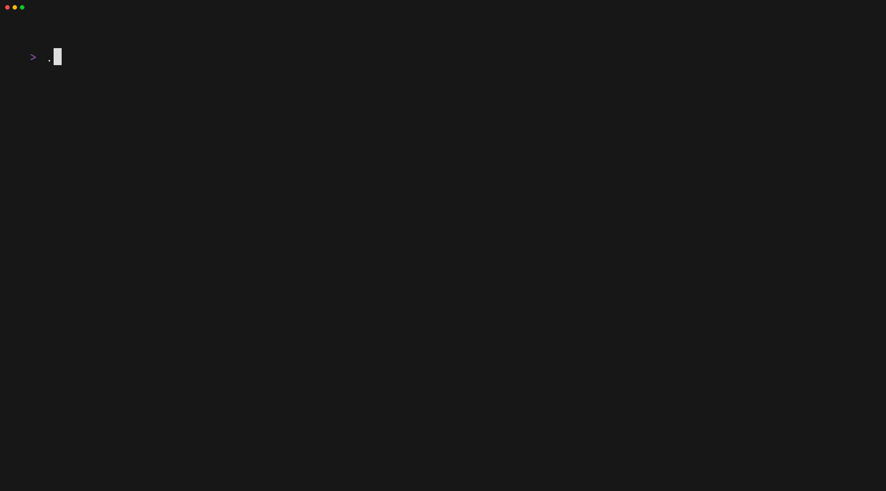

# kanash &nbsp;  &nbsp; [](https://ratatui.rs/)

Learn Kana in a terminal !
See https://kana.rezoleo.fr for a demo.



If your goal is to learn Japanese, you should take a look at [Awesome-Japanese](https://github.com/yudataguy/Awesome-Japanese) first.

## Installation

### With `cargo`

```
cargo install kanash
```

### On Arch Linux (AUR)

```
paru -S kanash
```

### From docker image

To expose it as a website:

```
sudo docker run --rm -p 80:80 blximages/kanash:kanash-ratzilla-v0.1.6
```

To run it directly in your terminal:

```
sudo docker run --rm -it --entrypoint=/usr/bin/kanash blximages/kanash
```

### WASM build

- Install [`trunk`](https://trunkrs.dev/).
- Clone this repo and go to the `kanash-ratzilla` folder.
- Build and serve the wasm file: `trunk serve`.

## Contribute

**Advices** and **PRs** are very much apreciated

## Acknowledgments

- [ratatui](https://github.com/ratatui/ratatui) :heart:
- [ratzilla](https://github.com/orhun/ratzilla)
- [ttyd](https://github.com/tsl0922/ttyd) (previously used)
- [wana-kana-rust](https://github.com/PSeitz/wana_kana_rust)

Also take a look at all the dependencies in [`Cargo.toml`](./Cargo.toml)
